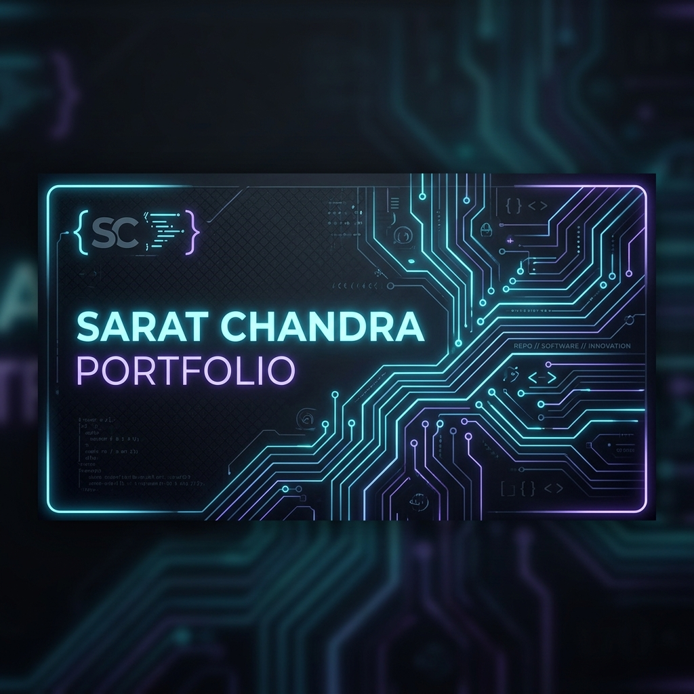

<div align="center">
  
</div>

<br/>

# 🌐 Personal Portfolio & Digital Showcase


[](https://sarat-2007.github.io/)
[](https://developer.mozilla.org/en-US/docs/Web/HTML)
[](https://developer.mozilla.org/en-US/docs/Web/CSS)
[](https://developer.mozilla.org/en-US/docs/Web/JavaScript)
[](https://opensource.org/licenses/MIT)

This is the repository hosting the official personal portfolio, project index, and professional credentials for **Nallabati Venkata Durga Sai Sarat Chandra**.

🔗 **Explore the Live Site here**: [https://sarat-2007.github.io/](https://sarat-2007.github.io/)

---

## ✨ Features

*   **Premium Interactive Layout**: A highly aesthetic, responsive user experience showcasing personal branding.
*   **Comprehensive Project Catalog**: Features real-world hardware & software integration projects, complete with links, descriptions, and media.
*   **Dynamic Tech Stack Highlighting**: Interactive badges showcasing core competencies in Edge AI, Robotics, Embedded Systems, and Web Engineering.
*   **Direct Credentials Access**: Integrated digital version of my latest professional curriculum vitae (`resume.pdf`).

---

## 🛠️ Built With

*   **HTML5 & Semantics**: Highly structured markup optimized for SEO and browser performance.
*   **Vanilla CSS3**: Curated custom styling containing smooth scroll behaviors, premium color gradients, responsive flex/grid layouts, and sleek dark modes.
*   **Modern JS (ES6+)**: Custom animations, dynamic content injection, and fluid interactive components.

---

## 📁 Repository Structure

```
.
├── index.html       # Main interactive portfolio interface
├── resume.pdf       # Professional curriculum vitae
└── README.md        # This repository guide
```

---

## 📄 License

This repository is licensed under the MIT License. Feel free to use the layout and structure for your own personal portfolio! See [LICENSE](LICENSE) for details.